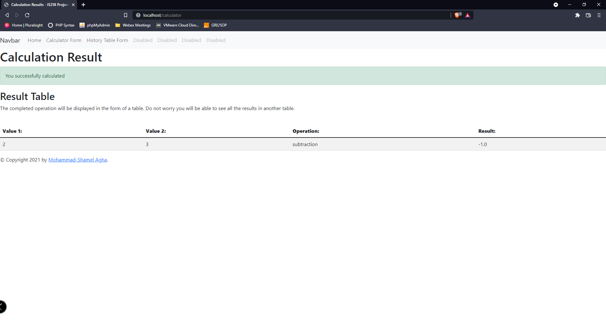
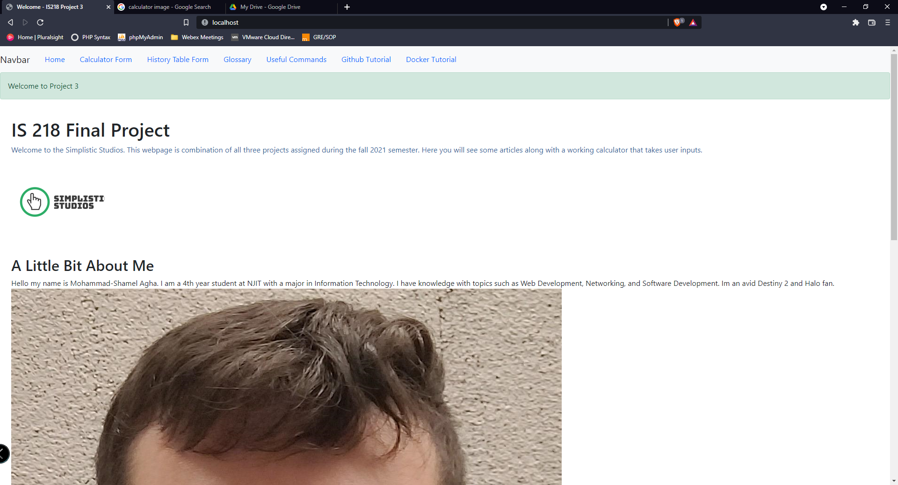

# Calculator Final Project

## Flash Message:  

## Table Generation:

## Pytest:

## Index:

## Calculator Form:

## Result Form:

## History Form:

## CSV File:

## Glossary:

## Commands:

## Git:

## Docker:

# Video Links:
## Main Demonstration:
  [Main Demo](https://youtu.be/Ux-bOTnixSQ)
## Responsiveness Demo:
  [Demo 2](https://youtu.be/YCuMQO44tm4)

